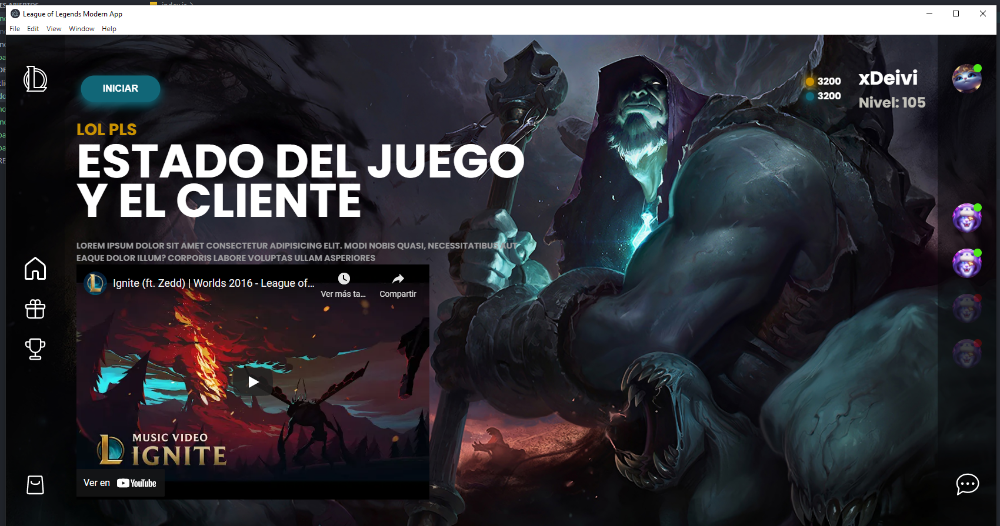

# Lol Modern Design

Rediseño de la aplicación de escritorio de league of legends en React+Eletron

## Preview


## Inicializar Proyecto
```cmd
npm install
npm run electron
```

## Stack
* React + Styled Components
* Electron


## Credit
Basado en el diseño de [Salomon Sanchez](https://dribbble.com/shots/15292090-Redesign-UX-UI-League-of-Legends-App)

# TODO's:
- [ ] Empaquetar la app como instalador
- [ ] Eliminar que el usuario pueda hacer rescalado de la ventana
- [ ] Añadir funcionalidad a la aplicación
# TODO's: Soñados
- [ ] Sistema de login
- [ ] Sistema de Amigos
- [ ] Crear un sistema de colas con Node.js
- [ ] Recuperar datos de una bbdd NoSql
- [ ] Añadir docker para node.js y la base de datos NoSql
